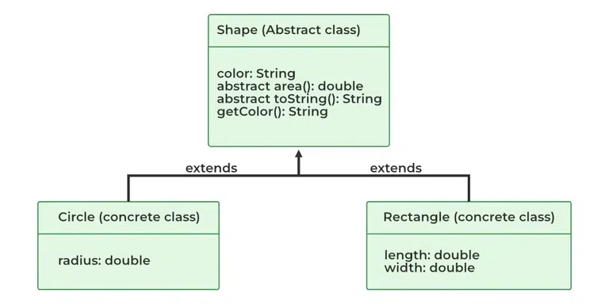

## Abstraction in java

Abstraction in Java is the process in which we only show essential details/functionality to the user. The non-essential implementation details are not displayed to the user.

In Java, abstraction is achieved by interfaces and abstract classes. We can achieve 100% abstraction using interfaces.

#### Java Abstract classes and Java Abstract methods

1. An abstract class is a class that is declared with an abstract keyword.
2. An abstract method is a method that is declared without implementation.
3. An abstract class may or may not have all abstract methods. Some of them can be concrete methods
4. A method-defined abstract must always be redefined in the subclass, thus making overriding compulsory or making the subclass itself abstract.
5. Any class that contains one or more abstract methods must also be declared with an abstract keyword.
6. There can be no object of an abstract class. That is, an abstract class can not be directly instantiated with the new operator.
7. An abstract class can have parameterized constructors and the default constructor is always present in an abstract class.


#### When to use abstract classes and abstract methods?

There are situations in which we will want to define a superclass that declares the structure of a given abstraction without providing a complete implementation of every method. Sometimes we will want to create a superclass that only defines a generalization form that will be shared by all of its subclasses, leaving it to each subclass to fill in the details.
<br>



``` java

abstract class Shape{
    String color;
    
    abstract double area();
    public abstract String toString();

    public Shape(String color){
        System.out.println("Shape constructor called");
        this.color = color;
    }

    // this is a concrete method
    public String getColor() { return color; }

}

class Circle extends Shape{
    double radius;

    public Circle(String color , double radius){
        super(color);
        System.out.println("Circle constructor called");
        this.radius = radius;
    }

     @Override double area()
    {
        return Math.PI * Math.pow(radius, 2);
    }

    @Override public String toString()
    {
        return "Circle color is " + super.getColor()
            + "and area is : " + area();
    }
}

class Rectangle extends Shape {

    double length;
    double width;

    public Rectangle(String color, double length,
                     double width)
    {
        // calling Shape constructor
        super(color);
        System.out.println("Rectangle constructor called");
        this.length = length;
        this.width = width;
    }

    @Override double area() { return length * width; }

    @Override public String toString()
    {
        return "Rectangle color is " + super.getColor()
            + "and area is : " + area();
    }
}
public class Test {
    public static void main(String[] args)
    {
        Shape s1 = new Circle("Red", 2.2);
        Shape s2 = new Rectangle("Yellow", 2, 4);

        System.out.println(s1.toString());
        System.out.println(s2.toString());
    }
}

```

### Interface

Interfaces are another method of implementing abstraction in Java. The key difference is that, by using interfaces, we can achieve 100% abstraction in Java classes. In Java or any other language, interfaces include both methods and variables but lack a method body. Apart from abstraction, interfaces can also be used to implement interfaces in Java.

``` java
interface Shape {
    double calculateArea(); // Abstract method for
                            // calculating the area
}

// Implement the interface in a class named Circle
class Circle implements Shape {
    private double radius;

    // Constructor for Circle
    public Circle(double radius) { this.radius = radius; }

    // Implementing the abstract method from the Shape
    // interface
    public double calculateArea()
    {
        return Math.PI * radius * radius;
    }
}

// Implement the interface in a class named Rectangle
class Rectangle implements Shape {
    private double length;
    private double width;

    // Constructor for Rectangle
    public Rectangle(double length, double width)
    {
        this.length = length;
        this.width = width;
    }

    // Implementing the abstract method from the Shape
    // interface
    public double calculateArea() { return length * width; }
}

// Main class to test the program
public class Main {
    public static void main(String[] args)
    {
        // Creating instances of Circle and Rectangle
        Circle myCircle = new Circle(5.0);
        Rectangle myRectangle = new Rectangle(4.0, 6.0);

        // Calculating and printing the areas
        System.out.println("Area of Circle: "
                           + myCircle.calculateArea());
        System.out.println("Area of Rectangle: "
                           + myRectangle.calculateArea());
    }
}
```

