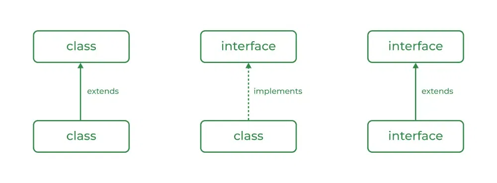
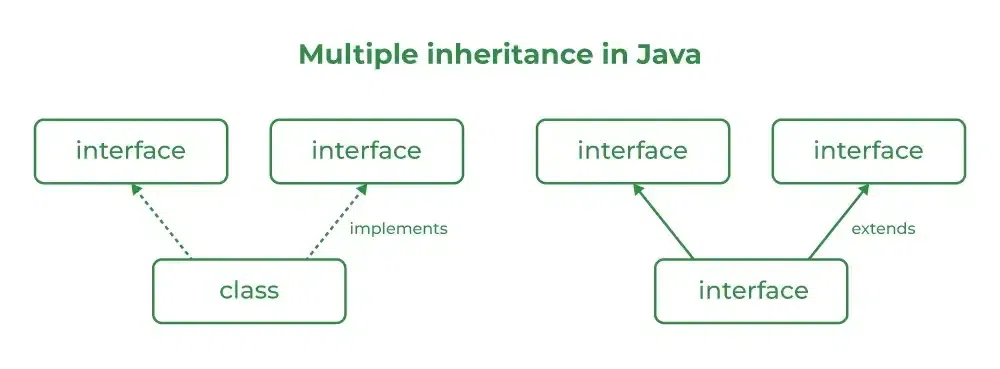

## Interfaces 

An Interface in Java programming language is defined as an abstract type used to specify the behavior of a class. An interface in Java is a blueprint of a behavior. A Java interface contains static constants and abstract methods.

The interface in Java is a mechanism to achieve abstraction.

#### Syntax

``` java
interface {
    // declare constant fields
    // declare methods that abstract 
    // by default.   
}
```

#### Uses of Interfaces in Java are mentioned below:

* It is used to achieve total abstraction.
* Since java does not support multiple inheritances in the case of class, by using an interface it can achieve multiple inheritances.
* Any class can extend only one class, but can implement multiple interfaces.
* It is also used to achieve loose coupling.
* Interfaces are used to implement abstraction. 

#### So, the question arises why use interfaces when we have abstract classes?

The reason is, abstract classes may contain non-final variables, whereas variables in the interface are final, public, and static.

#### Relationship Between Class and Interface

A class can extend another class, and similarly, an interface can extend another interface. However, only a class can implement an interface, and the reverse (an interface implementing a class) is not allowed.



#### Difference Between Class and Interface


<table><thead><tr><th style="width: 350px;"><p dir="ltr" style="text-align: center;"><span>Class</span></p>
</th><th style="width: 350px;"><p dir="ltr" style="text-align: center;"><span>Interface</span></p>
</th></tr></thead><tbody><tr><td style="width: 350px;"><span>In class, you can instantiate variables and create an object.</span></td><td style="width: 350px;"><span>In an interface, you must initialize variables as they are final but you can’t create an object. &nbsp; &nbsp; &nbsp; &nbsp; &nbsp; &nbsp; &nbsp; &nbsp; &nbsp; &nbsp; &nbsp;&nbsp;</span></td></tr><tr><td style="width: 350px;"><span>A class can contain concrete (with implementation) methods</span></td><td style="width: 350px;"><span>The interface cannot contain concrete (with implementation) methods.</span></td></tr><tr><td style="width: 350px;"><span>The access specifiers used with classes are private, protected, and public.</span></td><td style="width: 350px;"><span>In Interface only one specifier is used- Public.</span></td></tr></tbody></table>


#### Example code

``` java
// Java program to demonstrate working of
// interface

import java.io.*;

// A simple interface
interface In1 {
  
    // public, static and final
    final int a = 10;

    // public and abstract
    void display();
}

// A class that implements the interface.
class TestClass implements In1 {
  
    // Implementing the capabilities of
    // interface.
    public void display(){ 
      System.out.println("Geek"); 
    }

    // Driver Code
    public static void main(String[] args)
    {
        TestClass t = new TestClass();
        t.display();
        System.out.println(t.a);
    }
}

```


#### Example 2

``` java
import java.io.*;

interface Vehicle {
    
    // all are the abstract methods.
    void changeGear(int a);
    void speedUp(int a);
    void applyBrakes(int a);
}

class Bicycle implements Vehicle{
    
    int speed;
    int gear;
    
    // to change gear
    @Override
    public void changeGear(int newGear){
        
        gear = newGear;
    }
    
    // to increase speed
    @Override
    public void speedUp(int increment){
        
        speed = speed + increment;
    }
    
    // to decrease speed
    @Override
    public void applyBrakes(int decrement){
        
        speed = speed - decrement;
    }
    
    public void printStates() {
        System.out.println("speed: " + speed
            + " gear: " + gear);
    }
}

class Bike implements Vehicle {
    
    int speed;
    int gear;
    
    // to change gear
    @Override
    public void changeGear(int newGear){
        
        gear = newGear;
    }
    
    // to increase speed
    @Override
    public void speedUp(int increment){
        
        speed = speed + increment;
    }
    
    // to decrease speed
    @Override
    public void applyBrakes(int decrement){
        
        speed = speed - decrement;
    }
    
    public void printStates() {
        System.out.println("speed: " + speed
            + " gear: " + gear);
    }
    
}
class GFG {
    
    public static void main (String[] args) {
    
        // creating an instance of Bicycle
        // doing some operations
        Bicycle bicycle = new Bicycle();
        bicycle.changeGear(2);
        bicycle.speedUp(3);
        bicycle.applyBrakes(1);
        
        System.out.println("Bicycle present state :");
        bicycle.printStates();
        
        // creating instance of the bike.
        Bike bike = new Bike();
        bike.changeGear(1);
        bike.speedUp(4);
        bike.applyBrakes(3);
        
        System.out.println("Bike present state :");
        bike.printStates();
    }
}
```

#### Multiple Inheritance in Java Using Interface




###### Example code

``` java
// Java program to demonstrate How Diamond Problem
// Is Handled in case of Default Methods

// Interface 1
interface API {
    // Default method
    default void show()
    {

        // Print statement
        System.out.println("Default API");
    }
}

// Interface 2
// Extending the above interface
interface Interface1 extends API {
    // Abstract method
    void display();
}

// Interface 3
// Extending the above interface
interface Interface2 extends API {
    // Abstract method
    void print();
}

// Main class
// Implementation class code
class TestClass implements Interface1, Interface2 {
    // Overriding the abstract method from Interface1
    public void display()
    {
        System.out.println("Display from Interface1");
    }
    // Overriding the abstract method from Interface2
    public void print()
    {
        System.out.println("Print from Interface2");
    }
    // Main driver method
    public static void main(String args[])
    {
        // Creating object of this class
        // in main() method
        TestClass d = new TestClass();

        // Now calling the methods from both the interfaces
        d.show(); // Default method from API
        d.display(); // Overridden method from Interface1
        d.print(); // Overridden method from Interface2
    }
}
```

