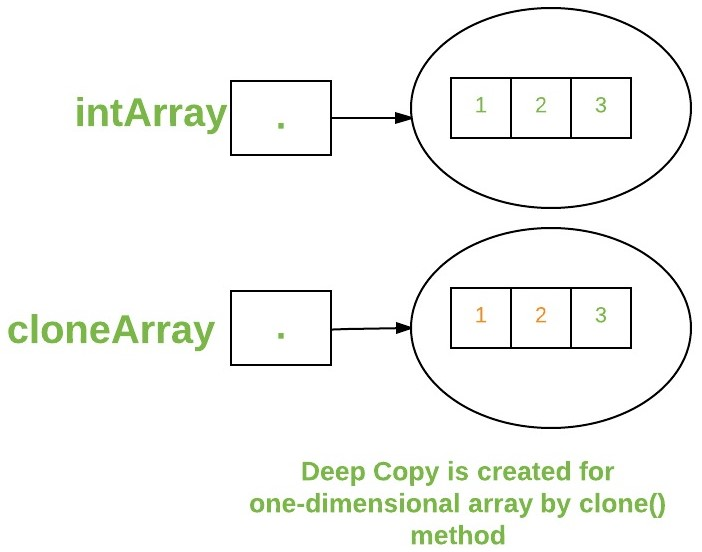
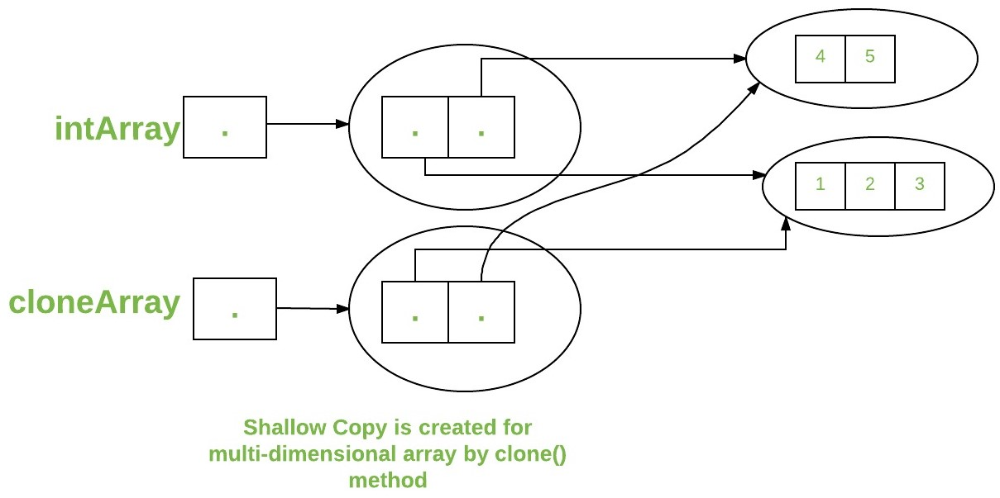

## Arrays

[back](dataStructures.md)

#### 1D array 

``` java
type var-name[];
OR
type[] var-name;

// both are valid declarations\
int intArray[];
or int[] intArray;

MyClass myClassArray[]; 

Object[]  ao,        // array of Object

Collection[] ca;  // array of Collection\
// of unknown type

```

``` java
int intArray[];    //declaring array\
intArray = new int[20];  // allocating memory to array

OR
int[] intArray = new int[20]; // combining both statements in one

```


``` java
class GFG 
{
    public static void main (String[] args) 
    {         
      // declares an Array of integers.
      int[] arr;
        
      // allocating memory for 5 integers.
      arr = new int[5];
        
      // initialize the first elements of the array
      arr[0] = 10;
        
      // initialize the second elements of the array
      arr[1] = 20;
        
      //so on...
      arr[2] = 30;
      arr[3] = 40;
      arr[4] = 50;
        
      // accessing the elements of the specified array
      for (int i = 0; i < arr.length; i++)
         System.out.println("Element at index " + i + 
                                      " : "+ arr[i]);          
    }
}
```

#### Multi-dimensional arrays

``` java
int[][] intArray = new int[10][20]; //a 2D array or matrix
int[][][] intArray = new int[10][20][10]; //a 3D array
```


``` java
class multiDimensional
{
    public static void main(String args[])
    {
        // declaring and initializing 2D array
        int arr[][] = { {2,7,9},{3,6,1},{7,4,2} };

        // printing 2D array
        for (int i=0; i< 3 ; i++)
        {
            for (int j=0; j < 3 ; j++)
                System.out.print(arr[i][j] + " ");

            System.out.println();
        }
    }
}
```

#### Passing arrays to method

``` java
class Test
{    
    // Driver method
    public static void main(String args[]) 
    {
        int arr[] = {3, 1, 2, 5, 4};
        
        // passing array to method m1
        sum(arr);
    
    }

    public static void sum(int[] arr) 
    {
        // getting sum of array values
        int sum = 0;
        
        for (int i = 0; i < arr.length; i++)
            sum+=arr[i];
        
        System.out.println("sum of array values : " + sum);
    }
}
```

#### Returning Arrays from Methods

```java

class Test
{    
    // Driver method
    public static void main(String args[]) 
    {
        int arr[] = m1();
        
        for (int i = 0; i < arr.length; i++)
            System.out.print(arr[i]+" ");
    
    }

    public static int[] m1() 
    {
        // returning  array
        return new int[]{1,2,3};
    }
}

```

#### Cloning of arrays

When you clone a single dimensional array, such as Object[], a "deep copy" is performed with the new array containing copies of the original array's elements as opposed to references.

``` java

class Test
{    
    public static void main(String args[]) 
    {
        int intArray[] = {1,2,3};
        
        int cloneArray[] = intArray.clone();
        
        // will print false as deep copy is created
        // for one-dimensional array
        System.out.println(intArray == cloneArray);
        
        for (int i = 0; i < cloneArray.length; i++) {
            System.out.print(cloneArray[i]+" ");
        }
    }
}

```




A clone of a multidimensional array (like Object[][]) is a "shallow copy" however, which is to say that it creates only a single new array with each element array as a reference to an original element array but subarrays are shared.


``` java

class Test
{    
    public static void main(String args[]) 
    {
        int intArray[][] = {{1,2,3},{4,5}};
        
        int cloneArray[][] = intArray.clone();
        
        // will print false
        System.out.println(intArray == cloneArray);
        
        // will print true as shallow copy is created
        // i.e. sub-arrays are shared
        System.out.println(intArray[0] == cloneArray[0]);
        System.out.println(intArray[1] == cloneArray[1]);
        
    }
}

```




