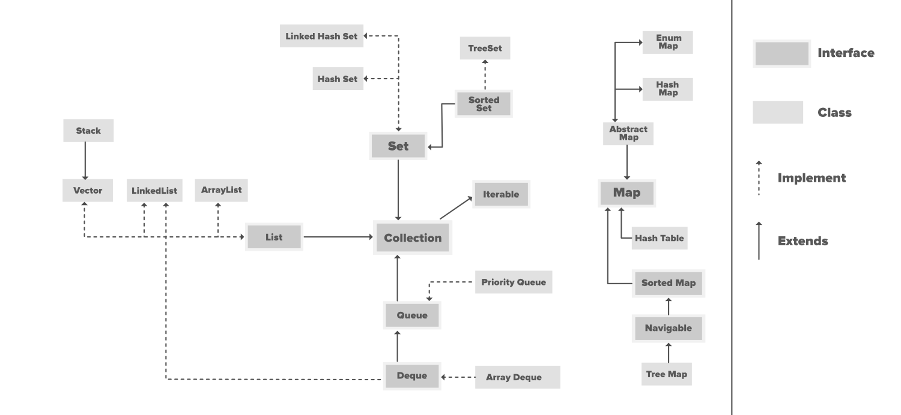

## Collections Overview

[back](dataStructures.md)


### Collection hierarchy



### Generics in java

``` java
// Using generics converts run time exceptions   
// into compile time exception. 
import java.util.*; 

// Generic class
class Pair<T, S> {
    T x;
    S y;
}
class Test 
{ 
    public static void main(String[] args) 
    { 
        // Creating object of generic class
        Pair<Integer, String> p = new Pair<Integer, String>();
        
        // Compiles fine because
        // p being an object accepts integer
        p.x = 12;
        
        // Compiles fine because
        // p being an object accepts string
        p.y = "GfG";
        
        // This shows compiler error
        // as p.x was an integer and cannot be
        // casted to a string
        String str = (String) p.x;
    } 
} 
```

Working of a generic function.

``` java
import java.util.*; 

class Test 
{ 
    // Declaration of generic function
    // Type parameters defined before 
    // return type
    public static<T> int count(T arr[], T x)
    {
        int res = 0;
        
        // Traverse the array
        for(T e: arr)
        {
            if (e.equals(x))
                res++;
        }
        return res;
    }
    public static void main(String[] args) 
    { 
        Integer arr[] = {10, 20, 30, 40, 10, 30};
        System.out.println(count(arr, 10));
    } 
} 
```

### Wildcards in generics

---Pending

### Collection interface


