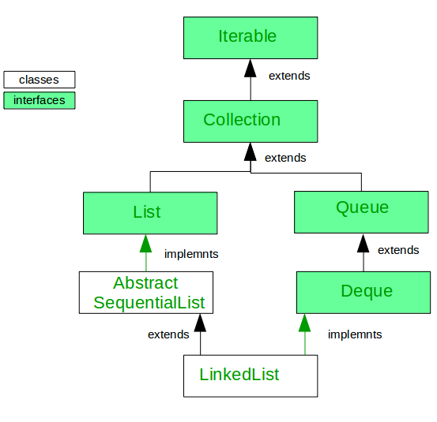

## LinkedList

[back](dataStructures.md)


Linked List is a part of the Collection framework present in java. util package. This class is an implementation of the LinkedList data structure which is a linear data structure where every element is stored as a separate object with a data part and address part. The elements are linked using pointers and addresses called nodes. It is rarely used in a production scenario but it has its own advantages. Basically it can be used in two particular cases.
 

It can be used as an ArrayList when the list type operation is performed for eg, insertion, deletion, remove, etc. It implements all the functions of the List interface just like an ArrayList.
It can be also be used as an ArrayDeque when queue or dequeue type of operations are performed, thus implementing the Deque interface.




### Advantages of LinkedList class in Java.
 

1. The LinkedList allows Dynamic Memory allocation, which means that memory allocation is done at the run time by the compiler, unlike the Arrays where the size is needed to be fixed from before.
2. LinkedList elements don’t need contiguous memory locations.
3. Insert and delete operations in the LinkedList are less expensive even in the worst case due to the reference of the previous and next elements which is highly unlikely in the case of ArrayList and ArrayDeque which internally uses a resizable array.


### Disadvantages of LinkedList class in Java.
 

1. The nodes cannot be accessed directly instead we need to start from the head and follow through the link to reach to a node we wish to access.
2. ArrayList will have fewer cache misses while traversal than the LinkedList. Therefore it is more cache-friendly.


``` java

// Java code implementing LinkedList
import java.util.LinkedList; 

public class GfG { 

    public static void main(String args[]) 
    { 
        // Creating object of the 
        // class linked list 
        LinkedList<Integer> list 
        = new LinkedList<Integer>(); 

        // Adding elements to the linked list 
        list.add(10);
        list.add(20);
        list.add(30);
        
        // Displaying the LinkedList
        System.out.println(list); 
    } 
}

```

### Methods common to both LinkedList and ArrayList

<table><tbody><tr><th>Method</th><th>Description</th><th>Time Complexity</th></tr><tr><th><a href="https://www.geeksforgeeks.org/java-util-linkedlist-add-method-in-java/" target="_blank"><strong>add(E e)</strong></a></th><th>This method Appends the specified element to the end of this list.</th><th>Theta(1)</th></tr><tr><th><a href="https://www.geeksforgeeks.org/java-util-linkedlist-add-method-in-java/" target="_blank"><strong>add(int index, E element)</strong></a></th><th>This method Inserts the specified element at the specified position in this list.</th><th>Theta(index)</th></tr><tr><th><a href="https://www.geeksforgeeks.org/linkedlist-contains-method-in-java/" target="_blank"><strong>contains(Object o)</strong></a></th><th>This method returns true if this list contains the specified element.</th><th>O(n)</th></tr><tr><th><a href="https://www.geeksforgeeks.org/linkedlist-remove-method-in-java/" target="_blank"><strong>remove(int index)</strong></a></th><th>This method removes the element at the specified position in this list.</th><th>Theta(index)</th></tr><tr><th><a href="https://www.geeksforgeeks.org/linkedlist-remove-method-in-java/" target="_blank"><strong>remove(Object o)</strong></a></th><th>This method removes the first occurrence of the specified element from this list, if it is present.</th><th>O(n)</th></tr><tr><th><a href="https://www.geeksforgeeks.org/linkedlist-get-method-in-java/" target="_blank"><strong>get(int index)</strong></a></th><th>This method returns the element at the specified position in this list.</th><th>Theta(index)</th></tr><tr><th><a href="https://www.geeksforgeeks.org/linkedlist-set-method-in-java/" target="_blank"><strong>set(int index, E element)</strong></a></th><th>This method replaces the element at the specified position in this list with the specified element.</th><th>Theta(index)</th></tr><tr><th><a href="https://www.geeksforgeeks.org/linkedlist-indexof-method-in-java/" target="_blank"><strong>indexOf(Object o)</strong></a></th><th>This method returns the index of the first occurrence of the specified element in this list, or -1 if this list does not contain the element.</th><th>O(n)</th></tr><tr><th><a href="https://www.geeksforgeeks.org/linkedlist-lastindexof-method-in-java/" target="_blank"><strong>lastIndexOf(Object o)</strong></a></th><th>This method returns the index of the last occurrence of the specified element in this list, or -1 if this list does not contain the element.</th><th>O(n)</th></tr><tr><th><strong>isEmpty()</strong></th><th>This method is used to check if a list is empty or not.</th><th>O(1)</th></tr></tbody></table>


### Methods implementing Queue interface

<table><tbody><tr><th>Method</th><th>Description</th></tr><tr><th><a href="https://www.geeksforgeeks.org/java-util-linkedlist-add-method-in-java/" target="_blank"><strong>add(E e)</strong></a></th><th>This method Appends the specified element to the end of this list. Throws exception when element cannot be added to the list.</th></tr><tr><th><a href="https://www.geeksforgeeks.org/linkedlist-remove-method-in-java/" target="_blank"><strong>remove()</strong></a></th><th>This method retrieves and removes the head (first element) of this list. Throws exception when the list is empty.</th></tr><tr><th><a href="https://www.geeksforgeeks.org/linkedlist-element-method-in-java-with- examples/" target="_blank"><strong>element()</strong></a></th><th>This method retrieves, but does not remove, the head (first element) of this list. Throws exception when the list is empty.</th></tr><tr><th><a href="https://www.geeksforgeeks.org/java-util-linkedlist-offer-offerfirst-offerlast-java/" target="_blank"><strong>offer(E e)</strong></a></th><th>This method Adds the specified element as the tail (last element) of this list. Returns null when element cannot be added to the list .</th></tr><tr><th><a href="https://www.geeksforgeeks.org/java-util-linkedlist-poll-pollfirst-polllast- examples-java/" target="_blank"><strong>poll()</strong></a></th><th>This method retrieves and removes the head (first element) of this list. Returns null when the list is empty.</th></tr><tr><th><a href="https://www.geeksforgeeks.org/java-util-linkedlist-peek-peekfirst-peeklast-java/" target="_blank"><strong>peek()</strong></a></th><th>This method retrieves, but does not remove, the head (first element) of this list. Returns null when the list is empty.</th></tr></tbody></table>


### Methods implementing DeQueue interface

<table><tbody><tr><th>Method</th><th>Description</th><th>Unsuccesful Response</th></tr><tr><th><a href="https://www.geeksforgeeks.org/linkedlist-addfirst-method-in-java/" target="_blank"><strong>addFirst(E e)</strong></a></th><th>This method Inserts the specified element at the beginning of this list.</th><th>Throws Exception</th></tr><tr><th><a href="https://www.geeksforgeeks.org/linkedlist-addlast-method-in-java/" target="_blank"><strong>addLast(E e)</strong></a></th><th>This method Appends the specified element to the end of this list.</th><th>Throws Exception</th></tr><tr><th><a href="https://www.geeksforgeeks.org/linkedlist-removefirst-method-in-java/" target="_blank"><strong>removeFirst()</strong></a></th><th>This method removes and returns the first element from this list.</th><th>Throws Exception</th></tr><tr><th><a href="https://www.geeksforgeeks.org/linkedlist-removelast-method-in-java/" target="_blank"><strong>removeLast()</strong></a></th><th>This method removes and returns the last element from this list.</th><th>Throws Exception</th></tr><tr><th><a href="https://www.geeksforgeeks.org/java-util-linkedlist-get-getfirst-getlast-java/" target="_blank"><strong>getFirst()</strong></a></th><th>This method returns the first element in this list.</th><th>Throws Exception</th></tr><tr><th><a href="https://www.geeksforgeeks.org/linkedlist-getlast-method-in-java/" target="_blank"><strong>getLast()</strong></a></th><th>This method returns the last element in this list.</th><th>Throws Exception</th></tr><tr><th><a href="https://www.geeksforgeeks.org/java-util-linkedlist-offer-offerfirst-offerlast-java/" target="_blank"><strong>offerFirst(E e)</strong></a></th><th>This method Inserts the specified element at the front of this list.</th><th>Returns Null</th></tr><tr><th><a href="https://www.geeksforgeeks.org/java-util-linkedlist-offer-offerfirst-offerlast-java/" target="_blank"><strong>offerLast(E e)</strong></a></th><th>This method Inserts the specified element at the end of this list.</th><th>Returns Null</th></tr><tr><th><a href="https://www.geeksforgeeks.org/java-util-linkedlist-poll-pollfirst-polllast- examples-java/" target="_blank"><strong>pollFirst()</strong></a></th><th>This method retrieves and removes the first element of this list, or returns null if this list is empty.</th><th>Returns Null</th></tr><tr><th><a href="https://www.geeksforgeeks.org/java-util-linkedlist-poll-pollfirst-polllast- examples-java/" target="_blank"><strong>pollLast()</strong></a></th><th>This method retrieves and removes the last element of this list, or returns null if this list is empty.</th><th>Returns Null</th></tr><tr><th><a href="https://www.geeksforgeeks.org/java-util-linkedlist-peek-peekfirst-peeklast-java/" target="_blank"><strong>peekFirst()</strong></a></th><th>This method retrieves, but does not remove, the first element of this list, or returns null if this list is empty.</th><th>Returns Null</th></tr><tr><th><a href="https://www.geeksforgeeks.org/java-util-linkedlist-peek-peekfirst-peeklast-java/" target="_blank"><strong>peekLast()</strong></a></th><th>This method retrieves, but does not remove, the last element of this list, or returns null if this list is empty.</th><th>Returns Null</th></tr></tbody></table>


### ArrayList vs LinkedList

<table><thead><tr><th>ArrayList</th><th>LinkedList</th></tr></thead><tbody><tr><td>This class uses a dynamic array to store the elements in it. With the introduction of <a href="https://www.geeksforgeeks.org/generics-in-java/" target="_blank">generics</a>, this class supports the storage of all types of objects.</td><td>This class uses a <a href="https://www.geeksforgeeks.org/doubly-linked-list/" target="_blank">doubly linked list</a> to store the elements in it. Similar to the ArrayList, this class also supports the storage of all types of objects.</td></tr><tr><td>Manipulating ArrayList takes more time due to the internal implementation. Whenever we remove an element, internally, the array is traversed and the memory bits are shifted.</td><td>Manipulating LinkedList takes less time compared to ArrayList because, in a doubly-linked list, there is no concept of shifting the memory bits. The list is traversed and the reference link is changed.</td></tr><tr><td>This class implements a <a href="https://www.geeksforgeeks.org/list-interface-java-examples/" target="_blank">List interface</a>. Therefore, this acts as a list.</td><td>This class implements both the List interface and the <a href="https://www.geeksforgeeks.org/deque-interface-java-example/" target="_blank">Deque interface</a>. Therefore, it can act as a list and a deque.</td></tr><tr><td>This class works better when the application demands storing the data and accessing it.</td><td>This class works better when the application demands manipulation of the stored data.</td></tr></tbody></table>


