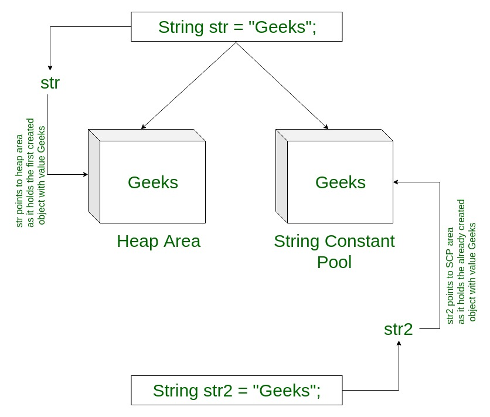
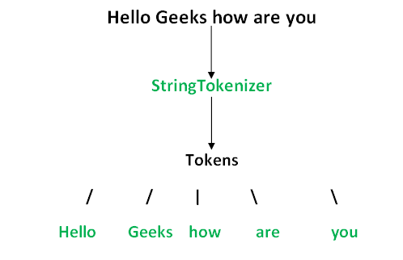

## Strings

[back](dataStructures.md)


``` java
String stringVariableName = "sequence_of_characters";
```


#### Memory allotment of String

Whenever a String Object is created, two objects are created- one in the Heap Area and one in the String constant pool, and the String object reference always points to the heap area object.



###### String buffer

The StringBuilder in Java represents a mutable sequence of characters. Since the String Class in Java creates an immutable sequence of characters, the StringBuilder class provides an alternate to String Class as it creates a mutable sequence of characters


``` java
StringBuffer s = new StringBuffer("GeeksforGeeks");
StringBuilder str = new StringBuilder();
str.append("GFG");
```

StringTokenizer: StringTokenizer class in Java is used to break a string into tokens




###### String compare

``` java
int str1.compareTo(String str2)

Working: It compares and returns the following values as follows:
if (string1 > string2), it returns a positive value.
if both the strings are equal lexicographically i.e.(string1 == string2), it returns 0.
if (string1 < string2), it returns a negative value.

```
Using String.equalsIgnoreCase() : The String.equalsIgnoreCase() method compares two strings irrespective of the case (lower or upper) of the string. This method returns true if the argument is not null and the contents of both the Strings are same, ignoring case, else it returns false.

``` java
str2.equalsIgnoreCase(str1);
```


``` java
// Java program to Compare two strings
// lexicographically
public class GFG {
    public static void main(String args[])
    {
        String string1 = new String("Geeksforgeeks");
        String string2 = new String("Practice");
        String string3 = new String("Geeks");
        String string4 = new String("Geeks");
        String string5 = new String("geeks");

        // Comparing for String 1 != String 2
        System.out.println("Comparing " + string1 + " and " + string2
                           + " : " + string1.equalsIgnoreCase(string2));

        // Comparing for String 3 = String 4
        System.out.println("Comparing " + string3 + " and " + string4
                           + " : " + string3.equalsIgnoreCase(string4));

        // Comparing for String 4 = String 5
        System.out.println("Comparing " + string4 + " and " + string5
                           + " : " + string4.equalsIgnoreCase(string5));

        // Comparing for String 1 != String 4
        System.out.println("Comparing " + string1 + " and " + string4
                           + " : " + string1.equalsIgnoreCase(string4));
    }
}
```

Using Objects.equals() : Object.equals(Object a, Object b) method returns true if the arguments are equal to each other and false otherwise. Consequently, if both arguments are null, true is returned and if exactly one argument is null, false is returned. Otherwise, equality is determined by using the equals() method of the first argument.


Objects.equals(string1, string4);


